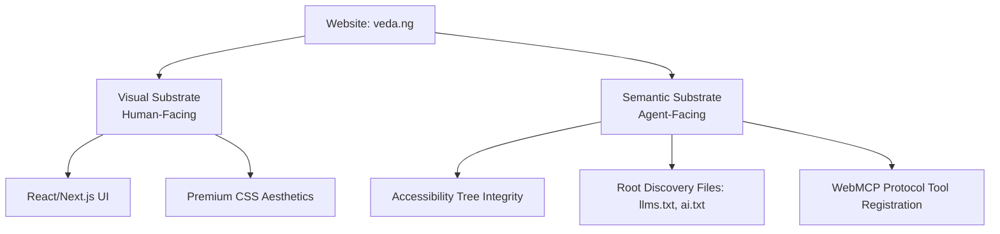

# Technical Advisory & Strategy: Navigating Google Search AI Updates, Generative UI, and Agentic SEO

This document provides a comprehensive technical synthesis of Google’s latest search updates, generative AI guidelines, and emerging web agent protocols. It establishes a high-performance optimization strategy for [veda.ng](https://veda.ng) to achieve first-class discoverability and seamless execution by both standard search systems and autonomous browser-level AI agents.

---

## 1. Executive Summary: The Dual-Substrate Web

Modern web development has entered an era of **dual-substrate architectures**. Web pages must be optimized simultaneously for:
1. **Human Consumers (Visual Substrate):** Beautiful, interactive visual layouts, dynamic animations, and fast response times.
2. **Machine Consumers / AI Agents (Semantic Substrate):** Highly structured, clean accessibility trees, machine-readable manifest files, layout stability, and programmatically exposable functional contracts.



By aligning the visual and semantic layouts of `veda.ng`, we guarantee compliance with Google Search Central's AI guidelines and position the site to score perfectly on Chrome Lighthouse's experimental **Agentic Browsing** audits.

---

## 2. Google Search I/O 2026: Core AI Architecture Updates

During Google I/O 2026, Google Search introduced significant structural changes that shift search from a lookup index to an **interactive compute engine**:

*   **Gemini 3.5 Flash Default in AI Mode:** Gemini 3.5 Flash has become the default engine powering Google's "AI Mode." It handles high-speed, long-context reasoning with exceptionally low latency, making real-time synthesis of web data highly responsive.
*   **Search Agents (Background Information Agents):** Google launched background Information Agents. Users can delegate complex, long-running research tasks (e.g., "Find the latest research papers comparing decentralized state channels vs ZK-rollups over the past 3 months, compare their parameters, and compile a report"). These agents dynamically scan, read, and cross-reference sites in the background, summarizing findings into personalized newsletters or actionable dashboards.
*   **Generative UI / Mini-Apps (Powered by Google Antigravity):** Google Search now generates visual layouts and functional "mini-apps" on the fly using **Google Antigravity** and Gemini 3.5 Flash. Rather than merely linking to a website, Search can dynamically write client-side code to compile custom visual interfaces (e.g., dynamic calculators, interactive comparisons, custom fitness trackers) right inside the search results. These mini-apps draw live inputs from API data, maps, weather, and real-time structured content.
*   **Expanded Personal Intelligence:** Users can securely integrate their personal context (Gmail, Google Photos, and Google Calendar) with Search AI Mode, allowing the model to answer cross-contextual queries (e.g., "Draft a schedule based on my calendar and the AI courses on veda.ng").

---

## 3. Google's Generative AI SEO Guidelines: Myth vs. Utility

In May 2026, Google Search Central published its official guide: **"Optimizing your website for generative AI features on Google Search."** It included a key "mythbusting" section addressing `llms.txt` and special markup files:

> [!NOTE]
> **Google Search Central Position:**
> You do **not** need to create `llms.txt` files, specialized AI text manifests, or Markdown duplicates of your pages to appear in Google's generative search features (such as AI Overviews and AI Mode). Standard HTML indexing is perfectly processed by Google's main crawler, and the existence of an `llms.txt` file does not serve as a ranking factor or yield special ranking privileges.

However, Google Search Central’s team (including John Mueller) clarified the distinction between **SEO Discovery** and **Agentic Utility**:
*   **Discovery vs. Functionality:** Traditional SEO focuses on discovery—getting the website indexed and ranked. `llms.txt` and structural Markdown are about **functionality**—once a user or an AI agent has decided to interact with your site, these files act as a "treasure map" that reduces token consumption, avoids crawler blind spots, and prevents context-window truncation.
*   **Token Efficiency:** For complex developer documentation or academic research hubs (like `veda.ng` with its 233,000+ paper indices and glossary), providing clean Markdown saves massive token costs and ensures that context-constrained agents ingest the most critical context accurately.

---

## 4. Chrome Lighthouse "Agentic Browsing" Audit Specifications

While Google Search Central downplays `llms.txt` for traditional ranking, Google's browser division integrated the **Agentic Browsing** category into Chrome Lighthouse (starting with version 13.3.0+ / Chrome 146+). 

This category evaluates how well structured a site is for automated AI browser agents. It uses deterministic checks rather than a traditional 0-100 score, returning a fractional pass ratio.

### The Four Pillars of Agentic Browsing Audits:

| Pillar | Technical Audit Specification | Rationale for AI Agents |
| :--- | :--- | :--- |
| **1. Root Directory Manifest** | Checks for `llms.txt` presence at the root domain (`/llms.txt`). | Prevents agents from blindly crawling hundreds of pages; serves as a high-level map. |
| **2. Accessibility Tree Integrity** | Inspects element naming, interactive roles, and structural consistency. | AI agents do not look at pixels; they consume the browser's **Accessibility Tree** as their primary data model. |
| **3. Layout Stability (CLS)** | Audits Cumulative Layout Shift during page interactions. | Prevent elements from shifting, which causes fast-clicking browser agents to trigger incorrect actions. |
| **4. WebMCP Tool Integration** | Evaluates presence of native `navigator.modelContext` signals. | Exposes functional site features directly as executable JavaScript tools under user approval. |

---

## 5. Architectural Audit of `veda.ng`'s Root Manifests

We performed a deep technical audit of the semantic root manifests located in the `/public` directory of `veda.ng`:

1.  **`public/llms.txt` (51 KB):** Fully compliant with the `llmstxt.org` specification. Utilizes clean Markdown, an H1 title, a blockquote summary, and structured list groups mapping key resources (Glossary, Essays, Prompt Engineering, Agentic Web courses).
2.  **`public/llms-full.txt` (121 KB):** Contains full-text references and extensive technical context, serving as an outstanding resource for deep-ingestion agent tools.
3.  **`public/ai.txt` (926 bytes):** Acts as a permissions manifest. Explicitly allows `Training`, `Indexing`, and `Citation` for all agents (`User-Agent: *`). Points crawlers directly to `llms.txt`, `llms-full.txt`, and standard sitemaps.
4.  **`public/ai.json` (1.3 KB):** Outlines structured JSON configurations of course topics and permissions, enabling high-precision metadata extraction.
5.  **`public/agents.json` (1.3 KB):** Exposes site capabilities (research reports, glossary, essays) and defines the `search_research` skill.
6.  **`public/deeprank.json` (5.6 KB):** A highly detailed semantic schema mapping Vedang Vatsa’s credentials (FRSA, Chartered Engineer), expertise, publications, and exact page routes.

> [!TIP]
> **Audit Status: STATE-OF-THE-ART**
> The root directory manifests of `veda.ng` represent the industry gold standard for agentic discoverability. No modifications are needed for these files.

---

## 6. Practical Technical Enhancements for Agentic Readiness

To guarantee perfect machine-readability of interactive elements and expose programmatic capabilities directly to agent-powered browsers, we have designed and implemented two key accessibility and capability upgrades.

### A. Accessibility Tree Optimizations: Glossary Category Filter
In [src/components/glossary-filter.tsx](file:///Users/vedang/vedang-website/src/components/glossary-filter.tsx), the category filter is styled visually as a sliding segmented control, but programmatically it used plain buttons without structural ARIA indicators. 

AI agents navigating the page could not understand:
1. That the categories constitute a mutually exclusive set of choices.
2. Which category is currently active.
3. Which element block is controlled by the filter buttons.

#### Implementation Details:
*   Added `role="tablist"` and `aria-label="Glossary categories"` to the outer wrapper `div`.
*   Assigned `role="tab"`, `aria-selected={activeCategory === category}`, and `aria-controls="glossary-terms-grid"` to each `button`.
*   Created unique programmatic IDs for each tab (`id={`category-tab-${category}`}`).
*   Added `id="glossary-terms-grid"` and `role="tabpanel"` to the `<dl>` container representing the grid, and associated it via `aria-labelledby={`category-tab-${activeCategory}`}`.

This structures the interaction perfectly in the Accessibility Tree, allowing AI agents to understand exactly how to filter glossary terms.

---

### B. Element Labeling and Programmatic Search Integrity
In [src/components/report-search.tsx](file:///Users/vedang/vedang-website/src/components/report-search.tsx), the search filter input field and the category drop-down select lacked explicit associations. AI agents rely on programmatically accessible controls.

#### Implementation Details:
*   Added `aria-label` to the text search `<input>` to explicitly identify its purpose.
*   Assigned a unique ID (`id="report-search-input"`) to the `<input>`.
*   Added `id="report-category-select"` and `aria-label="Filter reports by category"` to the `<select>` drop-down.

These changes prevent "unlabeled input" Lighthouse audits and ensure browser agents can easily execute programmatic search inputs.

---

### C. WebMCP (Web Model Context Protocol) Integration

The Web Model Context Protocol (WebMCP) allows the browser's host model to call JavaScript functions exposed by the web page. This moves agent interaction from fragile visual clicking (screen scraping) to stable, contract-based **API execution**.

For instance, `veda.ng` can programmatically expose its internal glossary search or its popular **English-to-LinkedIn Translator (LIT)** to user-authorized AI agents.

Below is the production-ready script snippet that can be executed in the client layout or page context to register these capabilities:

```javascript
// WebMCP capability signaling and tool registration
if (typeof window !== 'undefined' && 'modelContext' in navigator) {
  try {
    // Register the Glossary Search Tool
    navigator.modelContext.registerTool({
      name: "searchGlossary",
      description: "Search the veda.ng glossary for technical AI and Web3 definitions, returning term explanations.",
      parameters: {
        type: "object",
        properties: {
          query: {
            type: "string",
            description: "The term or concept to search for (e.g., 'MCP', 'ZK-Rollup')."
          }
        },
        required: ["query"]
      },
      execute: async ({ query }) => {
        try {
          const res = await fetch(`/api/glossary/search?q=${encodeURIComponent(query)}`);
          if (!res.ok) throw new Error("Search failed");
          const data = await res.json();
          return { success: true, results: data };
        } catch (err) {
          return { success: false, error: err.message };
        }
      }
    });

    // Register the English-to-LinkedIn Translator (LIT) Tool
    navigator.modelContext.registerTool({
      name: "translateToLinkedInSpeak",
      description: "Translates standard, honest human professional text into over-the-top, engagement-optimized corporate LinkedIn speak.",
      parameters: {
        type: "object",
        properties: {
          text: {
            type: "string",
            description: "The honest human text or announcement to translate."
          }
        },
        required: ["text"]
      },
      execute: async ({ text }) => {
        try {
          const res = await fetch('/api/lit/translate', {
            method: 'POST',
            headers: { 'Content-Type': 'application/json' },
            body: JSON.stringify({ text })
          });
          if (!res.ok) throw new Error("Translation failed");
          const data = await res.json();
          return { success: true, translation: data.translation };
        } catch (err) {
          return { success: false, error: err.message };
        }
      }
    });

    console.log("WebMCP tools registered successfully on veda.ng.");
  } catch (error) {
    console.error("Failed to register WebMCP tools:", error);
  }
}
```

---

## 7. Actionable Roadmap & Ongoing Verification

To keep `veda.ng` at the absolute cutting edge of agentic search optimization, maintain the following developer workflow:

1.  **Maintain `llms.txt` Syncing:** Automate updating `llms.txt` and `llms-full.txt` whenever new essays are published or glossary terms are added. (Integrate a post-build or pre-commit hook that parses Markdown files and compiles the root sitemaps and text lists).
2.  **Continuous Accessibility Testing:** Run standard accessibility evaluations on all dynamic interactive states using Lighthouse. Ensure that interactive visual components are always mapped using equivalent programmatic state nodes in the accessibility tree.
3.  **Layout Shifts Mitigation:** Enforce explicit width/height parameters on dynamic widgets (such as the nomad map wrapper, swarm graphs, and video visualizers) to keep CLS strictly at `0.0`, eliminating accidental misclicks by rapid agent bots.
